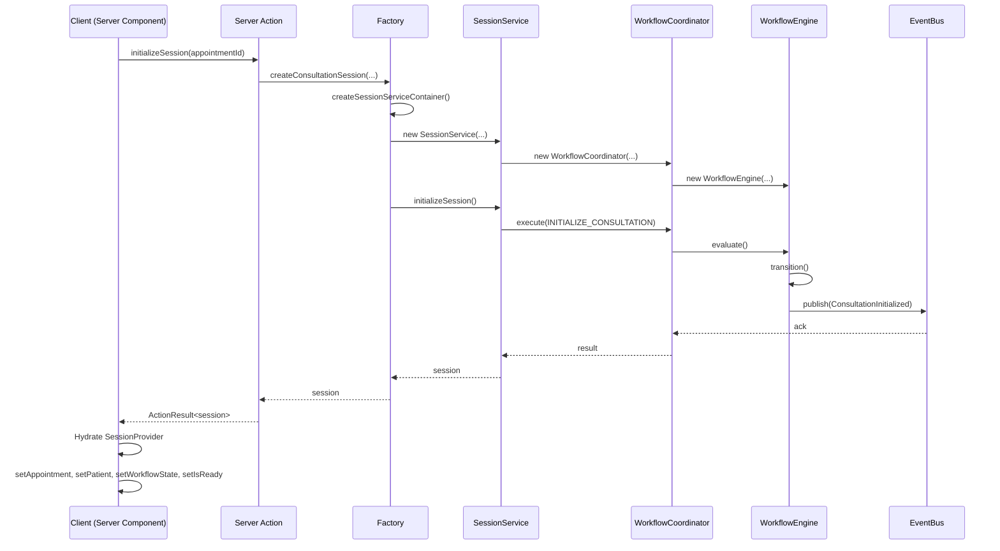
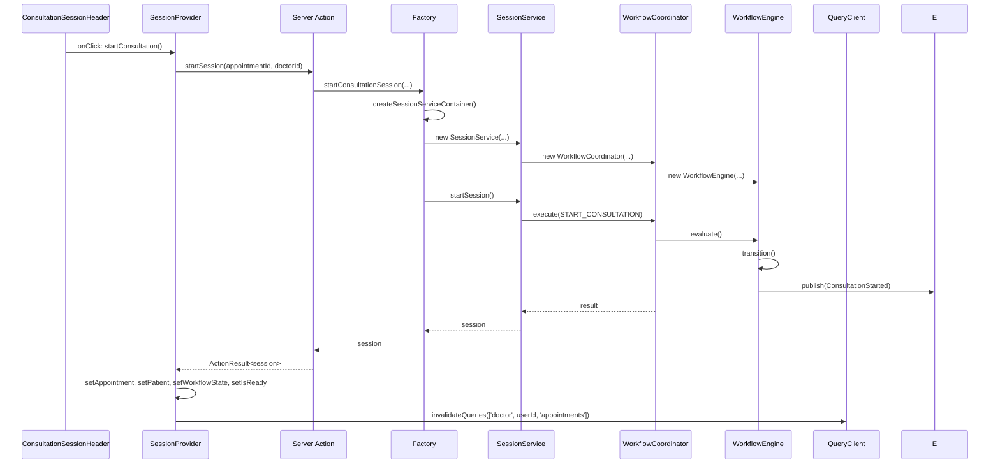
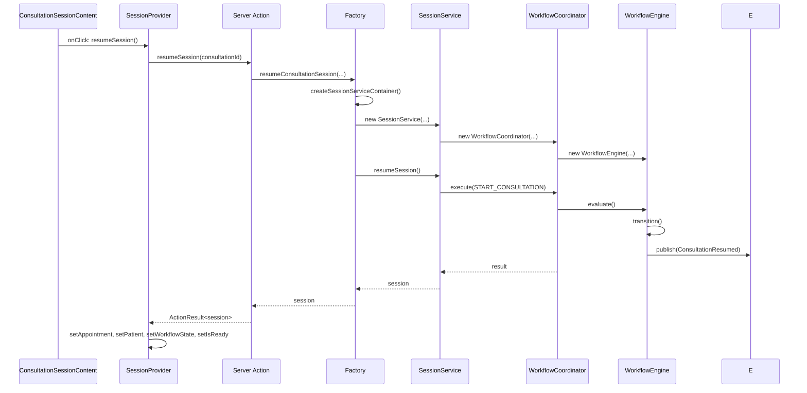
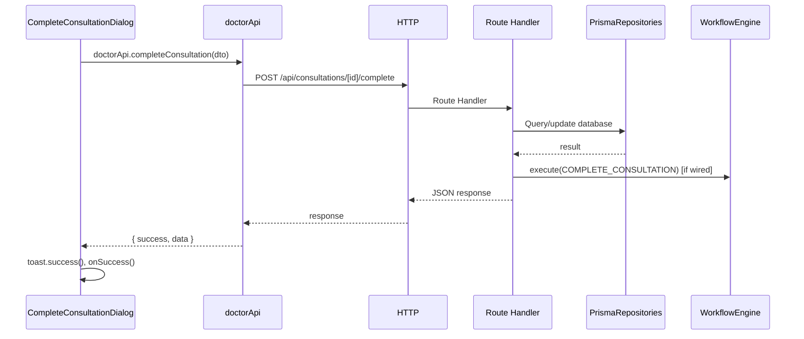
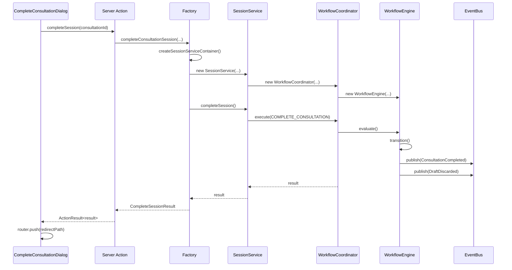
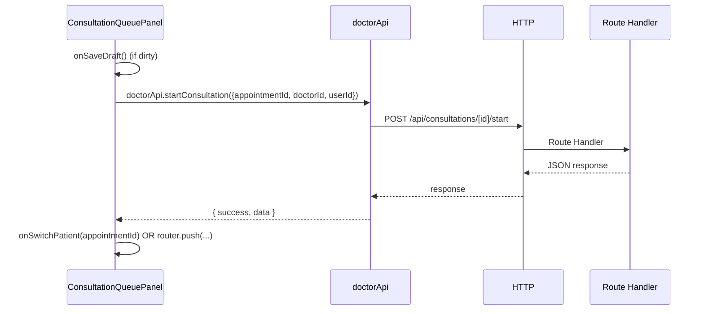
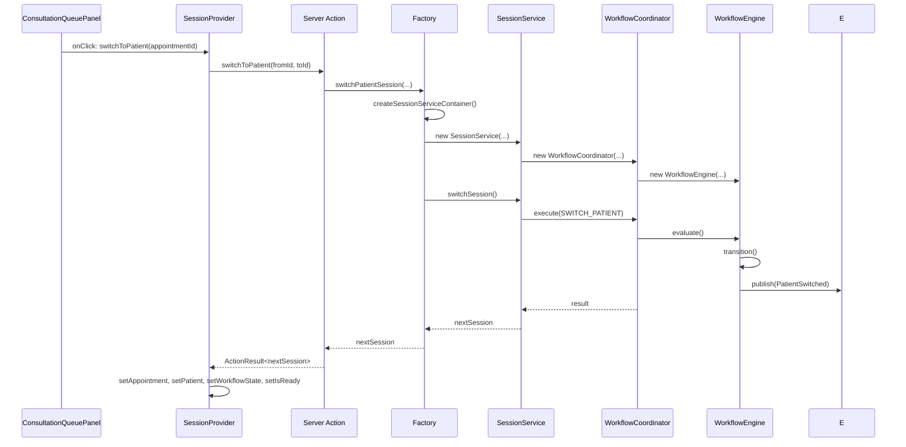
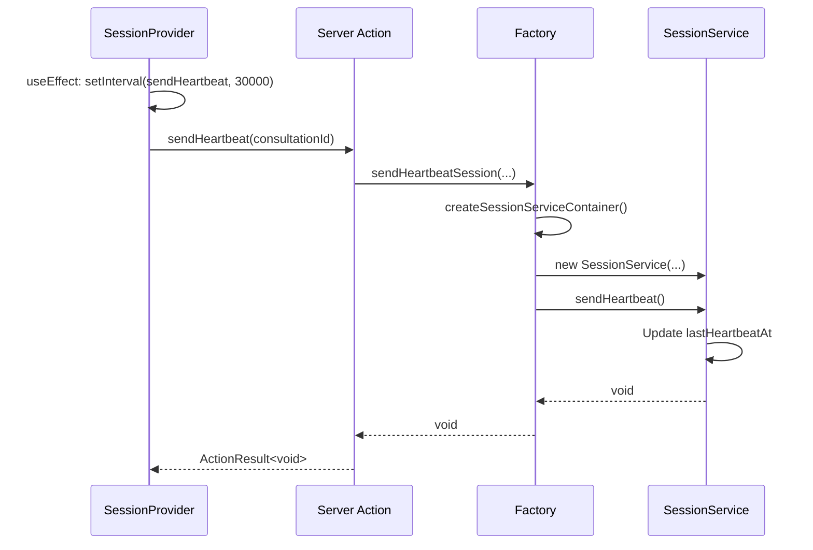
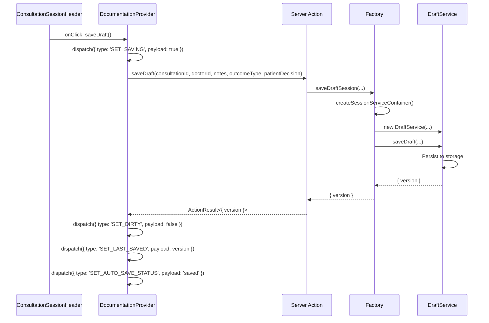
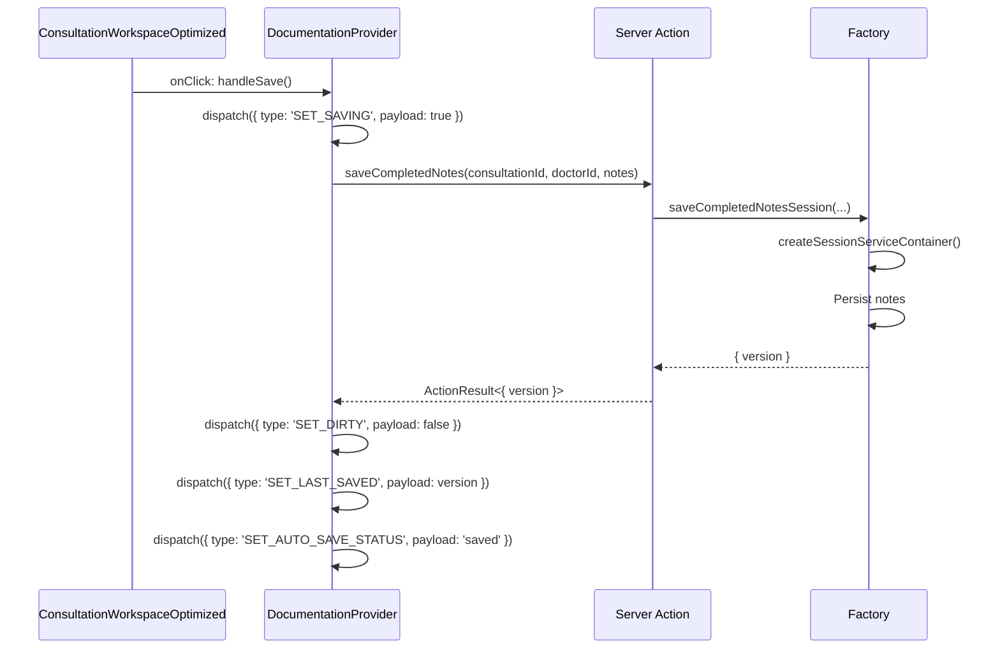

# Runtime Sequence Verification

## Executive Summary

This document produces runtime sequence diagrams for all consultation feature mutation flows. Every server/client boundary crossing is highlighted.

**Date:** 2026-07-26  
**Status:** 4 SEQUENCES VERIFIED, 4 VIOLATIONS DOCUMENTED

---

## 1. Initialize Sequence

**Boundary Crossings:** 1 (Client → Server Action)  
**Status:** ✅ MIGRATED

---

## 2. Start Sequence

**Boundary Crossings:** 1 (Provider → Server Action)  
**Status:** ✅ MIGRATED

---

## 3. Resume Sequence

**Boundary Crossings:** 1 (Provider → Server Action)  
**Status:** ✅ MIGRATED

---

## 4. Complete Sequence

### 4.1 Current (VIOLATION)

**Boundary Crossings:** 1 (Client → Route Handler) — bypasses Server Action  
**Status:** 🚨 VIOLATION

### 4.2 Expected (After Fix)

**Boundary Crossings:** 1 (UI → Server Action)  
**Status:** ✅ EXPECTED

---

## 5. Switch Patient Sequence

### 5.1 Current (VIOLATION)

**Boundary Crossings:** 1 (Client → Route Handler) — bypasses Server Action  
**Status:** 🚨 VIOLATION

### 5.2 Expected (After Fix)

**Boundary Crossings:** 1 (Provider → Server Action)  
**Status:** ✅ EXPECTED

---

## 6. Heartbeat Sequence

**Boundary Crossings:** 1 (Provider → Server Action)  
**Status:** ⚠️ STUBBED — boundary exists

---

## 7. Save Draft Sequence

**Boundary Crossings:** 1 (Provider → Server Action)  
**Status:** ⚠️ STUBBED — boundary exists

---

## 8. Save Notes Sequence

**Boundary Crossings:** 1 (Provider → Server Action)  
**Status:** ⚠️ STUBBED — boundary exists

---

## 9. Certification

| Sequence | Boundary Crossings | Status |
|----------|-------------------|--------|
| Initialize | 1 Client → Server Action | ✅ MIGRATED |
| Start | 1 Provider → Server Action | ✅ MIGRATED |
| Resume | 1 Provider → Server Action | ✅ MIGRATED |
| Complete | 1 Client → Route Handler (VIOLATION) | 🚨 NOT MIGRATED |
| Switch | 1 Client → Route Handler (VIOLATION) | 🚨 NOT MIGRATED |
| Heartbeat | 1 Provider → Server Action (STUB) | ⚠️ STUBBED |
| Save Draft | 1 Provider → Server Action (STUB) | ⚠️ STUBBED |
| Save Notes | 1 Provider → Server Action (STUB) | ⚠️ STUBBED |

**Verdict: 4 MIGRATED, 2 VIOLATIONS, 2 STUBBED**
