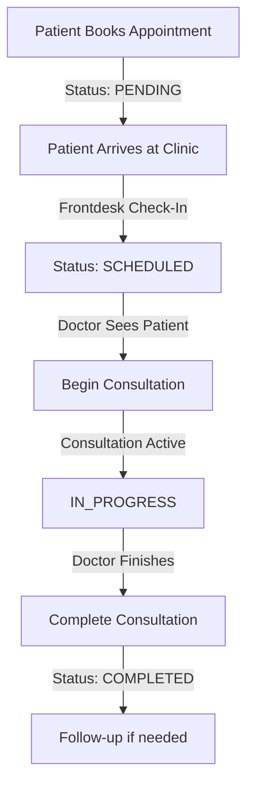

# Appointment Workflow - Quick Reference

## 🔄 The Complete Journey (6 Stages)

---

## 📱 What Happens at Each Stage

### **1️⃣ Patient Books** (`/patient/dashboard`)
**Patient does:**
- Selects doctor & views profile
- Picks date with available slots
- Selects specific time slot (e.g., 10:30 AM)
- Enters procedure type + notes
- Submits booking

**System creates:**
- Appointment with **status: PENDING**
- Confirmation dialog shows success
- Patient redirected to `/patient/appointments`

**Patient sees:**
- ✅ "Appointment Booked!" message
- 📅 Date & time details
- 📧 Reminder: "You'll get email/SMS 24hrs before"
- 🏥 Instruction: "Arrive 15 mins early"

---

### **2️⃣ Patient Arrives** (Day of Appointment)
**Frontdesk does:**
- Opens `/frontdesk/appointments`
- Finds patient's appointment (shows PENDING)
- Clicks "Check In" button
- Confirms check-in

**System updates:**
- Status changes: **PENDING → SCHEDULED**
- Records check-in time & staff member
- Tracks if patient is late

**Frontdesk sees:**
- ✅ "Patient checked in successfully"
- Dashboard updates: Checked-in count increases
- Appointment card now shows "SCHEDULED"

---

### **3️⃣ Doctor Views Appointments** (`/doctor/appointments`)
**Doctor sees:**
- List of today's checked-in patients (SCHEDULED)
- Patient cards showing:
  - Name, file number
  - Appointment time
  - Procedure type
  - "Begin Consultation" button (green)

**Doctor can:**
- Click "View Profile" → See full patient history
- Click "Begin Consultation" → Start session

---

### **4️⃣ Doctor Starts Consultation**
**Doctor clicks:**
- "Begin Consultation" button

**Dialog appears:**
- Shows patient safety info
- Pre-consultation notes field (optional)
- "Begin Consultation" button

**System does:**
- Creates `Consultation` record
- Status: **IN_PROGRESS**
- Records start time & doctor
- **Redirects to**: `/doctor/consultations/{appointmentId}/session`

---

### **5️⃣ Active Consultation Session** (`/doctor/consultations/{id}/session`)
**Doctor sees full workspace:**

**Left Panel - Patient Info:**
- Name, age, file number
- Vital signs
- Allergies & conditions
- Appointment details

**Main Area - Tabs:**
- **Overview**: Patient summary
- **Clinical Notes**: Note-taking (Chief Complaint, HPI, Assessment, Plan)
- **Examination**: Physical findings
- **Images**: Patient photos
- **History**: Past consultations

**Right Panel - Structured Notes:**
- Chief Complaint
- History of Present Illness
- Assessment
- Plan
- **Outcome Type dropdown:**
  - Treatment Plan Provided
  - Surgery Recommended
  - Referral Made
  - Follow-up Scheduled
  - No Treatment Required
- **Patient Decision** (if surgery):
  - Accepted
  - Declined
  - Needs time to decide

**Quick Actions:**
- 👤 "View Full Profile" → `/doctor/patients/{id}?from=consultation`
- 📋 "Add Vital Signs"
- 🎯 "Cases & Procedures"
- 💾 "Save Notes" (auto-saves too)
- ✅ "Complete Consultation"

---

### **6️⃣ Doctor Completes Consultation**
**Doctor clicks:**
- "Complete Consultation" button

**Dialog shows:**
- Consultation summary
- **Follow-up scheduling (optional):**
  - Date picker
  - Time slot selector
  - Appointment type
- Final notes confirmation
- "Complete" button

**System does:**
- Status changes: **SCHEDULED → COMPLETED**
- Consultation marked complete
- Records outcome & timestamp
- **If follow-up selected:**
  - Creates new appointment (status: PENDING)
  - Links to original appointment

**Doctor sees:**
- ✅ Success message
- Redirected to appointments/consultations page
- Appointment moves to "Completed" section

---

## 🎯 Quick Status Reference

| Status | Meaning | Who Sees It |
|--------|---------|-------------|
| **PENDING** | Booked, not arrived | Patient, Frontdesk |
| **SCHEDULED** | Checked in, waiting | Doctor, Frontdesk |
| **IN_PROGRESS** | Consultation active | Doctor (Consultation) |
| **COMPLETED** | Finished | All users (history) |
| **CANCELLED** | Cancelled | All users |

---

## 🔍 Where to Find What

### **Patient:**
- **Book appointment**: Dashboard → "Book Appointment" button
- **View appointments**: `/patient/appointments`
- **See history**: Same page, filter by status

### **Frontdesk:**
- **See today's appointments**: `/frontdesk/appointments`
- **Check in patient**: Click "Check In" on PENDING appointments
- **Register new patient**: Dashboard → "Register Patient"

### **Doctor:**
- **See appointments**: `/doctor/appointments`
- **Active consultations**: `/doctor/consultations`
- **Patient profiles**: `/doctor/patients`
- **Consultation session**: Click "Begin Consultation"

---

## 📧 Notifications (Current & Planned)

### **Currently:**
- ✅ In-app toast notifications
- ✅ Status updates in real-time

### **Planned:**
- 📧 Email reminders 24h before
- 📱 SMS reminders 24h before
- 🔔 Doctor notified when patient checks in
- 📨 Patient notified when consultation completed
- 📄 Consultation report sent via email

---

## 💡 Pro Tips

### **For Patients:**
- Book early! Popular doctors fill up fast
- Check "Available slots" count before selecting date
- Arrive 15 minutes early for check-in
- View your appointments to see status updates

### **For Frontdesk:**
- Use date filter to focus on today's appointments
- Search by patient name for quick check-in
- Filter by "Pending" to see who hasn't checked in
- Keep an eye on "Pending Check-ins" counter

### **For Doctors:**
- Use "View Profile" during consultation for full patient history
- Save notes frequently (auto-save is enabled)
- "Complete Consultation" dialog lets you schedule follow-up instantly
- Access patient profile anytime with "Back to Consultation" button

---

## 🚨 Important Notes

1. **Only available slots are shown** - If you see a slot, it's bookable!
2. **Check-in is required** - Doctor can't start consultation until patient is SCHEDULED
3. **One consultation at a time** - Complete current before starting next
4. **Notes are saved automatically** - But manual save is also available
5. **Follow-ups link to original** - Easy to track patient journey

---

## 🎉 What Just Got Fixed

The "slot already taken" bug you experienced was caused by the system showing all slots (even booked ones) to patients. Now:

✅ **Only truly available slots** are displayed
✅ **Booked slots** (PENDING/SCHEDULED) are automatically hidden
✅ **Cancelled/Completed** slots are freed up for rebooking
✅ **Real-time conflict detection** prevents double booking
✅ **Appointments save correctly** and return the ID immediately

---

**📖 Full Documentation:** See `APPOINTMENT_BOOKING_WORKFLOW.md` for complete technical details.
